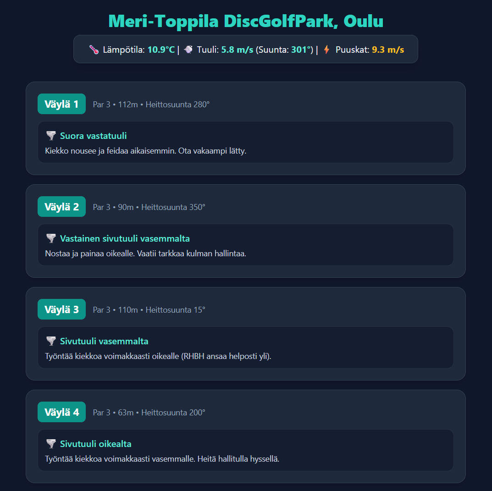

# Wind Caddie

## 🚀 Ominaisuudet

* **Reaaliaikainen säädata:** Hakee tuulen nopeuden, suunnan ja puuskat suoraan [Open-Meteo API](https://open-meteo.com/) -rajapinnasta.
* **Vektorilaskenta:** Laskee tuulen suunnan ja väylän heittosuunnan välisen erotuksen, minkä perusteella määritellään tuulityyppi (myötätuuli, vastatuuli, sivutuuli jne.).
* **Väyläkohtaiset caddie-kortit:** Esittää jokaisen väylän tiedot (par, pituus, heittosuunta) ja tuilisuositukset selkeässä käyttöliittymässä.
* **Tietokantaintegraatio:** Kurssit ja väylätiedot tallennetaan PostgreSQL-tietokantaan.

---

## 🛠️ Teknologiat

* **Taustajärjestelmä:** Node.js, Express
* **Tietokanta:** PostgreSQL (yhteensopiva pilvipalveluiden, kuten Renderin, kanssa)
* **Säärajapinta:** Open-Meteo API
* **Käyttöliittymä:** HTML5, Tailwind CSS (CDN)
* **Muut kirjastot:** `axios`, `pg`, `cors`, `dotenv`
